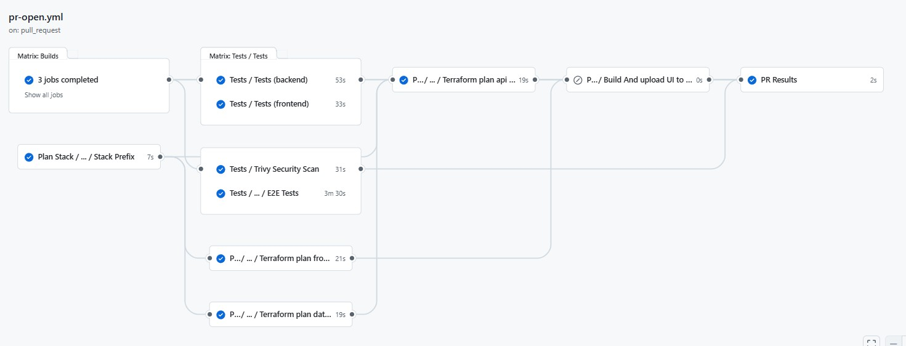
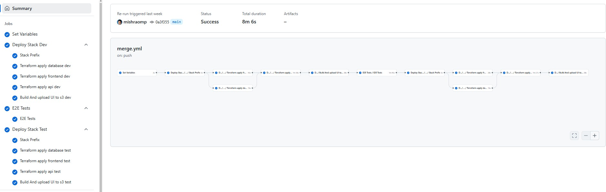

[](https://github.com/bcgov/quickstart-aws-containers/actions/workflows/merge.yml)
[](https://github.com/bcgov/quickstart-aws-containers/actions/workflows/pr-open.yml)
[](https://github.com/bcgov/quickstart-aws-containers/actions/workflows/pr-validate.yml)
[](https://github.com/bcgov/quickstart-aws-containers/actions/workflows/github-code-scanning/codeql)
[](https://github.com/bcgov/quickstart-aws-containers/actions/workflows/pause-resources.yml)
[](https://github.com/bcgov/quickstart-aws-containers/actions/workflows/pause-resources.yml)
# Quickstart for AWS using Aurora Serverless v2 (Postgis) , ECS Fargate and CloudFront ⚠️DRAFT⚠️
## Prerequisites

- BCGOV AWS account with appropriate permissions
- AWS CLI installed and configured (If interaction with AWS account is preferred)
- Docker/Podman installed (To run database and flyway migrations or whole stack)
- Node.js and npm installed (If not using docker compose for whole stack, to run backend and frontend)


# Folder Structure
```
/quickstart-aws-containers
├── .github/                   # GitHub workflows and actions
├── terraform/                 # Terragrunt configuration files
├── infrastructure/            # Terraform code for each component
│   ├── api/                   # API(ECS) related terraform code(backend)
│   ├── frontend/              # Cloudfront with WAF
│   ├── database/              # Aurora RDS database
├── backend/                   # Node Nest express backend API code
├── frontend/                  # Vite + React SPA
├── migrations/                # Flyway Migrations scripts to run database schema migrations
├── docker-compose.yml         # Docker compose file
├── README.md                  # Project documentation
└── package.json               # Node.js monorepo for eslint and prettier
```

- **.github/**: Contains GitHub workflows and actions for CI/CD.
- **terraform/**: Contains Terragrunt configuration files.
- **infrastructure/**: Contains Terraform code for each component.
    - **api/**: Contains Terraform code for the backend API (ECS).
    - **frontend/**: Contains Terraform code for Cloudfront with WAF.
    - **database/**: Contains Terraform code for Aurora RDS database.
- **backend/**: Contains Node Nest express backend API code.
- **frontend/**: Contains Vite + React SPA code.
- **docker-compose.yml**: Docker compose file for local development.
- **README.md**: Project documentation.
- **package.json**: Node.js monorepo configuration for eslint and prettier.

# Running Locally
## Running Locally with Docker Compose

To run the entire stack locally using the `docker-compose.yml` file in the root directory, follow these steps:

1. Ensure Docker (or Podman) is installed and running on your machine.
2. Navigate to the root directory of the project:
    ```sh
    cd <checkedout_repo_dir>
    ```
3. Build and start the containers:
    ```sh
    docker-compose up --build
    ```
4. The backend API should now be running at `http://localhost:3001` and the frontend at `http://localhost:3000`.

To stop the containers, press `Ctrl+C` in the terminal where `docker-compose` is running, or run:
```sh
docker-compose down
```
## Running Locally without Docker (Complex)
Prerequisites:

    1. Install JDK 17 and above.
    2. Install Node.js 22 and above.
    3. Install Postgres 16.4 with Postgis extension.
    4. Download flyway.jar file
Once all the softwares are installed follow below steps.

1. Run Postgres DB (better as a service on OS).
2. Run flyway migrations (this needs to be run everytime changes to migrations folder happen)
```sh
java -jar flyway.jar -url=jdbc:postgresql://$posgtres_host:5432/$postgres_db -user=$POSTGRES_USER -password=$POSTGRES_PASSWORD -baselineOnMigrate=true -schemas=$FLYWAY_DEFAULT_SCHEMA migrate
```
3. Run backend from root of folder.
```sh
cd backend
npm run start:dev or npm run start:debug
```
4. Run Frontend from root of folder.
```sh
cd frontend
npm run dev
```

# Deploying to AWS
1. Please follow the wiki link for AWS deployment [setup](https://github.com/bcgov/quickstart-aws-containers/wiki/Deploy-To-AWS-Using-Terraform)

## Pull Request Workflow


## Merge Workflow
